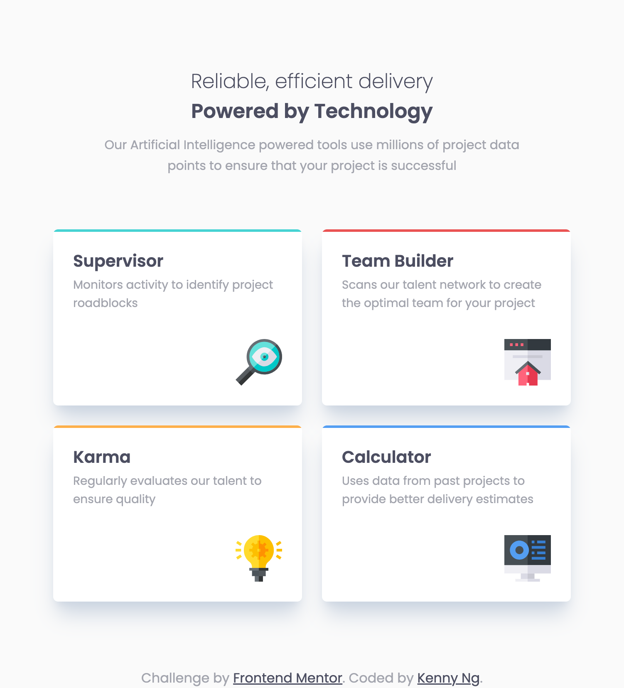

# Frontend Mentor - Four card feature section solution

This is a solution to the [Four card feature section challenge on Frontend Mentor](https://www.frontendmentor.io/challenges/four-card-feature-section-weK1eFYK). Frontend Mentor challenges help you improve your coding skills by building realistic projects.

## Table of contents

- [Overview](#overview)
  - [The challenge](#the-challenge)
  - [Screenshot](#screenshot)
  - [Links](#links)
- [My process](#my-process)
  - [Built with](#built-with)
  - [What I learned](#what-i-learned)
  - [Useful resources](#useful-resources)
- [Author](#author)

## Overview

### The challenge

Users should be able to:

- View the optimal layout for the site depending on their device's screen size

### Screenshot

Desktop version

Tablet version

Mobile version

### Links

- Solution URL: [https://www.frontendmentor.io/solutions/responsive-four-card-feature-section-nextjs-typescript-tailwindcss-zjQYOOPZ54](https://www.frontendmentor.io/solutions/responsive-four-card-feature-section-nextjs-typescript-tailwindcss-zjQYOOPZ54)
- Live Site URL: [https://fm-four-card-feature-section-kennylun123.vercel.app/](https://fm-four-card-feature-section-kennylun123.vercel.app/)

## My process

### Built with

- Semantic HTML5 markup
- CSS custom properties
- Flexbox
- CSS Grid
- Mobile-first workflow
- [React](https://reactjs.org/) - JS library
- [Next.js](https://nextjs.org/) - React framework
- TailwindCSS
- TypeScript

### What I learned

- This is my first challenge using TypeScript, TailwindCSS. I learned how to set up the utility-first enviorment and its stucture.

## Author

- Github - [Kenny Ng](https://www.github.com/kennylun123)
- Frontend Mentor - [@kennylun123](https://www.frontendmentor.io/profile/kennylun123)
- Twitter - [@kenny_ng123](https://www.twitter.com/kenny_ng123)
